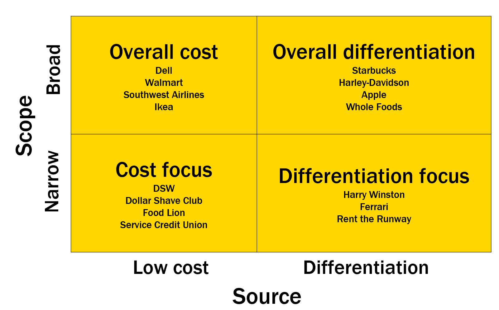

# Competitive Advantage

In this module, we move from the industry level to the firm level, where we want to know how firms can create and sustain competitive advantages. We learn the fundamental concepts in competitive advantage, and then see how they work in a cost leadership strategy.

By the end of this module you should be able to...

- Define "competitive advantage".
- Describe the generic strategies.
- Explain how a firm can create a competitive advantage with a cost leadership strategy.
- Explain the resource-based view of the firm.
- Explain how activities can create a competitive advantage.

---

## Competitive Advantage - What it is and how to get it

### Definition

A company earns more profit than the industry average because:

- Its costs are lower than the industry average, or
- It earns more revenue than the industry average, or
- A combination of the two.

### Generic Strategies

- **Willingness to pay**

  The maximum price at or below which a customer will definitely buy a product or service.

- **Net Profit**

  The difference between revenue and all the costs incurred to make, sell, and service a product.

- **Profit margin**

  Net profit as a percentage of revenue.

#### Sources of Cost Advantage

- Economies of scale
- Economies of scope

  Increases in efficiency (cost savings or reductions) due to sharing of activities across products.

- Learning and experience
- Proprietary knowledge
- Lower input costs
- A different business model

#### Sources of Differentiation Advantage

- Different Product features
  - Do a job better
  - Do more jobs
  - Do a unique job
- Higher quality or more reliability
- Convenience
- Brand image

#### Important Points

- Competitive advantage: bigger profit than industry average
- Four generic strategies
- Low-cost strategies rely on
  - Economies of scale and scope
  - Learning
  - Low-cost inputs
  - etc
- Differentiation strategies rely on
  - Quality
  - Product features
  - Convenience
  - Brand

---

## Sustaining a Competitive Advantage

### The Resource-Based View

A firm's resources and capabilities can produce a sustained competitive advantage by creating value for customers by

- lowering costs, or
- providing something of unique value, or
- some combination of the two

Types of Recourses and Capabilities:

- Physical
  - Plant and equipment
  - Access to raw materials
  - Locations
- Financial
  - Cash
  - Ability to borrow
  - Ability to generate cash flow
- Human
  - Knowledge, skills, abilities
  - Judgement
  - Intelligence
  - Relationships, trust, collaboration
- Organizational
  - Reporting structure
  - Standards and operating procedures
  - Formal and informal planning processes
  - Systems and processes for controlling and coordinating
- Intangible
  - Brand, image, reputation
  - Organizational culture
  - Employment brand
  - Intellectual properties

### VISOR Criteria

To give a firm a sustainable competitive advantage, a resource or capability must be:

- Valuable (i.e., must create value)
- Expensive to imitate or difficult to Imitate
- No Substitutes exist
- The firm is Organized to leverage the resource. (e.g., org.structure, compensation, culture)
- Rare among competitors

#### What makes imitation difficult?

- Path dependence

  A resource or capability arises from a series of unique decisions.

- Causal ambiguity

  We cannot identify clearly what caused the development of unique resources and capabilities.

- Social complexity

  A resource or capability resides in complex relationships among systems, departments, and people.

---

## How Activities Can Create a Competitive Advantage

### Strategic Positioning

- Strategy is the creation of a unique and valuable position involving a different set of activities.
- A firm must perform different activities from the competition or similar activities in different ways.
- Competitive advantage comes from the way that activities fit together and reinforce each other.
