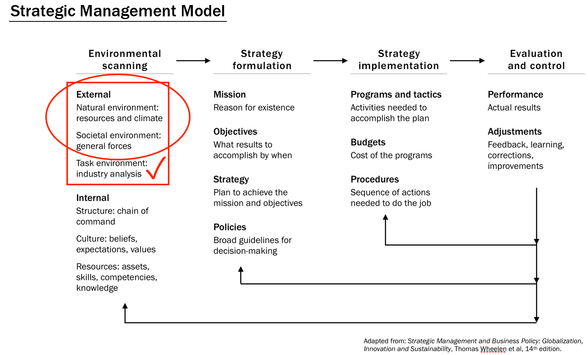
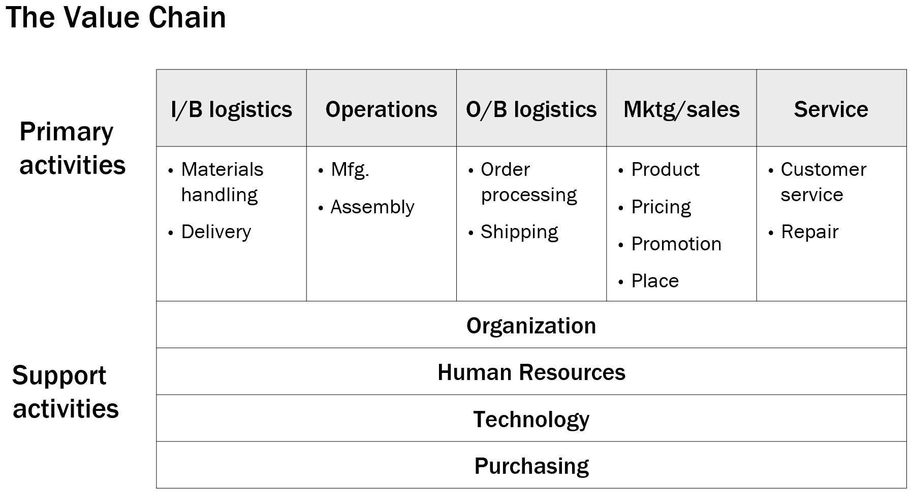

# External and Internal Analysis

In this module, we continue our study of competitive advantage by learning how a firm with a differentiation strategy can create (and sustain?) one. We also look at a couple activities that are important in strategy formulation for all firms, external and internal analysis, and conduct an external analysis.

By the end of this module you should be able to...

- Explain how a firm can create a competitive advantage with a differentiation strategy.
- Identify threats and opportunities and describe how firms can respond to them.

## External Analysis

> How threats and opportunities influence strategy

### Definitions 1

- **Threat**

  An element in the environment that is causing difficulty for the firm or could cause difficulty

- **Opportunity**

  Circumstances that make it possible to do something good for the firm

### Business Model

- Definition

  The rationale for how an organization does or could succeed

- Components

  - Value proposition: why certain kinds of customers buy the firm's products/services at the firm's price
  - How the firm is organized to deliver value
  - How the firm relates to others (partners, complimenters, distributors, et al.) to deliver value
  - How purchasing, pricing etc. product profit

### External Analysis (STEEP)

- Socio-Cultural
  - Demographic changes
  - Leisure habits
  - Attitudes and values
- Technological
  - Government spending on R&D
  - Telecom. infrastructure
  - Transport. infrastructure
- Economic
  - Disposable income
  - Exchange rates
  - Consumer confidence
- Ecological
  - Environment protection laws
  - Effects of climate change
  - Social responsibility
- Political-Legal
  - Laws and regulations
  - Trade restrictions and tariffs
  - Wars and conflicts

### A Process for External Analysis

1. Understand the firm's business model
1. Understand what the firm depends on in the business environment
1. Use STEEP to identify current and future threats and opportunities
1. Rank the threats and opportunities by importance
1. Formulate responses to the most important ones

### Important Points 1

- External factors influence strategy
- Firms should scan the business environment regularly
- External analysis helps identify threats and opportunities
- It must be done relative to the business model
- Decisions:
  - How to exploit opportunities
  - How to defend the firm against threats

---

## Internal Analysis

> How strengths and weaknesses influence strategy

### Definitions 2

- **Strength**

  A Valuable resource or capability possessed by the firm

- **Weakness**

  An internal characteristic of the firm that places the firm at a disadvantage

### SWOT Analysis

- Analysis identifies

  - Internal Strengths and Weaknesses
  - External Opportunities and Threats

- Long history in strategic planning
- Criticisms:
  - Too focused on present time
  - Often done superficially
  - Too much pride and politics
  - Too little candor
- But identifying strengths and weaknesses is important, so ...

### A Better Process for Internal Analysis

1. Understand the firm's business model
1. Identify resources and capabilities needed now and in the future
1. Use the value chain to identify actual and possible sources of competitive advantage
1. Evaluate important resources and capabilities to identify strengths and weaknesses
1. Rank the strengths and weaknesses by importance
1. Formulate responses to the most important ones

### The Value Chain

### Important Points 2

- Internal factors influence strategy
- Firms should scan the internal environment regularly
- Internal analysis helps identify strengths and weaknesses
- It must be done relative to the business model
- Decisions:
  - How to leverage strengths
  - How to shore up weaknesses
  - Which activities to do and not to
  - Which resources and capabilities to develop or acquire
