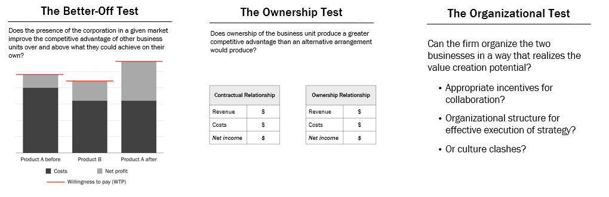

# Corporate Strategy

Learning Objectives

- Define important concepts:

  - Corporate strategy
  - Backward and forward vertical integration

- Identify three dimensions of corporate scope.
- State the objectives of corporate strategy.
- Describe three tests used to make corporate strategy decisions.

## Concepts

**Business-Level Strategy**: How to create a competitive advantage in a single product market.

**Corporate Strategy**: How to create competitive advantages by operating in multiple product markets.

## Three Questions

- Where to compete?

  - Industries and product markets
  - Geographical areas

- Which businesses to own?
- How to organize the businesses (structure, processes, incentives)?

## Three dimensions of corporate scope

- Horizontal Diversification

  Operating in an adjacent or unrelated market that is not in a value chain of the firm.

- Vertical Integration

  Operating in more stages of the value chain

- Geographic Dimension

  Where in the world? How to create or expand a competitive advantage internationally?

## Main Objectives of Corporate Strategy

To create and capture more value as a group of businesses than the businesses could create and capture on their own by ...

- Adding value to the underlying businesses
- Leveraging existing resources and capabilities
- Enhancing resources and capabilities

Make whole better than the sum of the parts.

## Three Tests of Decisions

- The better-off test
- The ownership test
- The organizational test

---

## Horizontal Scope

Learning Objectives:

- Describe the horizontal dimension of corporate scope.

- Define important concepts:

  - Revenue synergy (e.g., cross-selling)
  - Cost synergy (e.g., economies of scope)

- Explain why firms diversify horizontally.
- Explain the economic logic of bundling.

### Horizontal Diversification

Operating in an adjacent or unrelated market that is not in a value chain of the firm.

Why Diversify?

- To increase revenue
- To increase scale
- To increase sales of existing products by selling complementary products
- To achieve economies of scope
- To leverage and enhance resources and capabilities
- To balance seasonality of products

---

## Vertical Scope

Learning Objectives:

- Define important concepts:

  - Backward vertical integration
  - Forward vertical integration

- Explain when vertical integration might be appropriate
- Describe some risks of vertical integration

When should a firm consider operating in an additional stage of the value chain?

### Vertical Integration

Operating in more stages of the value chain

### Appropriate: Three Cs

- Capabilities

  The firm has the capabilities to do an activity well (and current partners may not).

- Coordination

  The firm can coordinate a new activity with other activities in the firm (and become better and more profitable by doing so).

- Control

  Over quality or valuable materials, resources, or activities.

- No market
- Increase WTP and/or lower costs

### Risks of Vertical Integration: Two Fs

- Loss of Focus

  Difficult to do many activities well

  - Can Netflix be good at streaming and production?
  - Can Amazon be good at air cargo and everything else?

- Less Flexibility

  More difficult to switch suppliers or distributors

  - New production technology appears?
  - A low cost competitor to UPS and FedEx appears?

---

## Ownership Considerations

When should a firm consider integrating vertically by buying a supplier or distributor as opposed to maintaining a contractual relationship?

Learning Objectives:

- Describe some factors in the ownership decision

  - Transaction costs
  - Incomplete contracts
  - Asset specificity
  - Hold-up

- Describe some risks of buying a supplier or distributor

- State when contractual relationships are better than ownership.

### Ownership Appropriate

Ownership is appropriate when

- High transaction costs

  - Search and information costs: to find and evaluate a transaction partner
  - Bargaining costs: If contracts must be negotiated frequently
  - Policing and enforcement costs: To ensure that the transaction partner complies with the terms

- Uncertainty and incomplete contracts

  - Writing and enforcing a contract is difficult due to uncertainty and/or complexity
  - Example: Disney and Pixar
    - Budgets, approvals, exclusivity, publicity, distribution, revenue sharing, ownership, creative control, termination, personnel

- Transaction-specific assets

  - Asset specificity and hold-up

Consider Ownership

- Durability

  The relationship between firms is ongoing

- Intellectual property

  Protecting intellectual property is difficult because knowledge must be transferred

- Urgency

  The firm needs a capability right away

Ownership Risk

- Incompatible cultures

### Contractual Relationship

A couple reasons why contractual relationship might be superior to ownership

- When incentives for performance are important
- When efficiency is important
  - De-centralized decision-making across firms (with a price mechanism) is often more efficient for allocating resources than intra-firm management.
