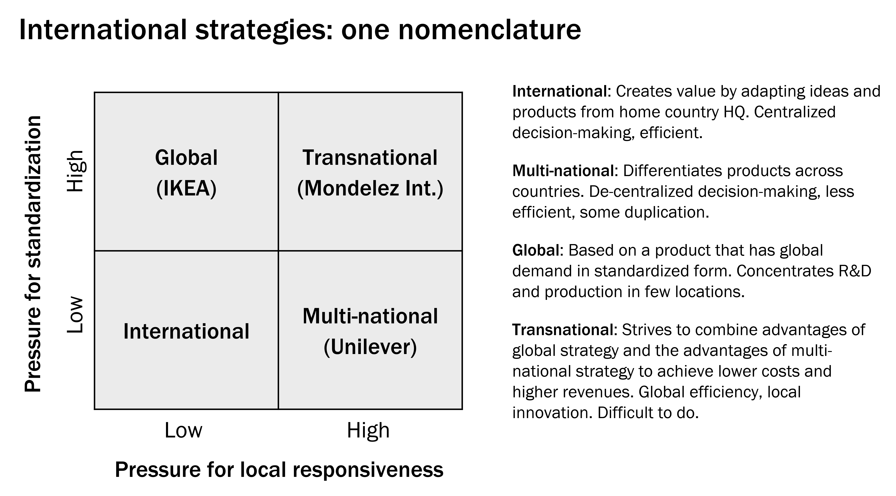
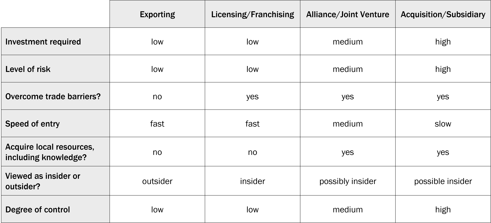

# International Strategy

In this module, we study international strategies. We will strive to answer three big questions: Why do firms expand internationally? How do firms expand internationally? How do firms decide where to expand internationally?

By the end of this module you should be able to...

- Explain why firms expand internationally.
- Describe how firms expand internationally.
- Define aggregation, arbitrage, and adaptation strategies.
- Describe and use a method for determining how attractive a foreign country is for expansion.
- Make strategically appropriate recommendations for a firm based on rigorous analysis.

## Why and Why not

Why Operate Internationally

- Increase revenue
- Leverage a comparative advantage
- Lower costs

  - labor
  - resources
  - Energy

    - Foreign companies are opening plaints in the USA because of inexpensive natural gas from fracking

  - Transportation
  - economies of scale
  - economies of scope

- Learn
- Other Reasons
  - Manage risk
    - e.g., recession in one region
  - Response to customers
    - e.g., big accounting firms
  - Response to competitors

ADDING Value Framework

- Add volume
- Decrease costs
- Differentiate (and increase WTP)
- Improve industry attractiveness
- Normalize risk
- Generate knowledge

Challenges

- International ventures often fail
- On average, globally diversified corporations trade at a discount
- Operating margins for USA firms competing globally are lower in other countries

Liability of Foreignness

- Costs due to foreignness:
  - Regulations that favor domestic firms
  - Fees for new patents and trademarks
  - Sub-optimal contract terms due to lack of familiarity with norms of negotiation
  - Learning about the regulatory environment, transportation system, etc.
- Costs of coordination across distance:
  - New technology
  - Longer hours
- And customers' WTP for a product from a foreign company may be lower.

Paradox of Consistency

- Success at home because of:
  - Internal consistency in value chain activities
  - External consistency between firm and home market environment
- The better adapted at home, the less well adapted abroad
- The companies that are most successful in their home countries are most likely to fail internationally.

Important points

- Many reasons to operate internationally
  - increase revenue, decrease costs
  - Exploit a comparative advantage
  - Manage risk
  - Learn
- International expansion is risky
  - Distance affects margins
  - Liability of foreignness
  - Paradox of consistency

---

## Aggregation, Arbitrage, and Adaptation

The AAA framework

- Arbitrage

  - Exploit differences between national or regional markets.
  - Often by locating parts of the supply chain in different countries

- Aggregation

  - Aggregate demand across countries
  - Create economies of scale through regional or global operations
  - Standardize products and services
  - Replicate the business model across countries. Group R&D and production together.

  Approaches to Aggregation

  1. Target a global customer segment
  1. Leverage a global product
  1. Leverage a product with global positioning
  1. Expand to a similar country or region

- Adaptation

  - Increase revenue and market share by maximizing a firm's local relevance
  - Appropriate when a product has cross-country demand but when preferences differ

Modes of Entry

- Exporting: Sends domestically-made products abroad to be sold by local firms.
- Licensing: Gives a local firm the right to manufacture and sell a firm's products, usually in exchange for royalties.
- Franchising: Gives a local firm rights to know-how, intellectual property, brand, and products in exchange for a fee.
- Joint venture (a form of strategic alliance): A business entity created and co-owned by a domestic firm and a local firm.
- Wholly-owned subsidiary (organic or through acquisition): A local company created and owned by the firm.

---

## CAGE Analysis

- Cultural
  - Different languages
  - Different ethnicities, lack of connective ethnic or social networks
  - Different religions
  - Different social norms
  - Idiosyncratic tastes
- Administrative/Political
  - Absence of colonial ties
  - Absence of shared monetary or political association (e.g., currency not shared)
  - Political hostility
  - Government policies and regulations
  - Weak legal and financial institutions
- Geographic
  - Physical remoteness
  - Lack of common border
  - Lack of sea or river access
  - Size of country
  - Weak transportation or communication links
  - Differences in climate
- Economic
  - Differences in consumer incomes
  - Differences in cost or quality of natural resources, financial resources, human resources, infrastructure, intermediate inputs, information and knowledge

Purpose of CAGE Analysis

- Identify industry-specific differences between two countries.
- Determine the attractiveness of a country for operations.
- Determine actions required for success in another country.

How to Conduct CAGE Analysis

1. Identify candidate countries.
1. Identify industry-specific differences between the home country and each of the other countries.
1. Give some consideration to the firm’s characteristics.
1. Decide if a country is attractive enough for expansion.
1. Set plans for overcoming the “distances”.
